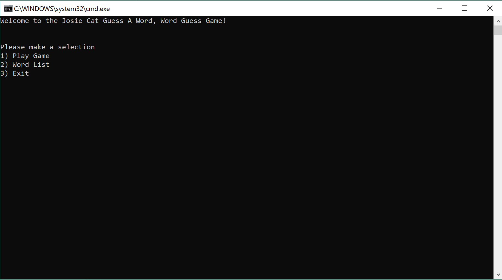
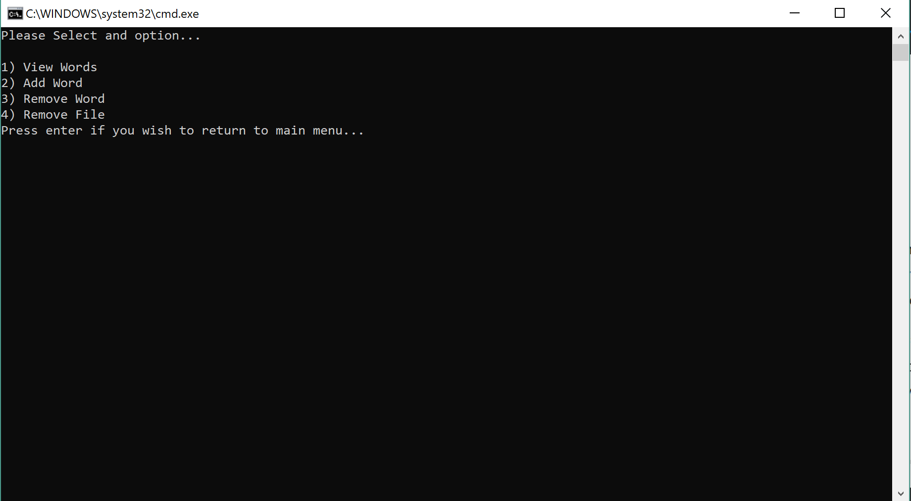
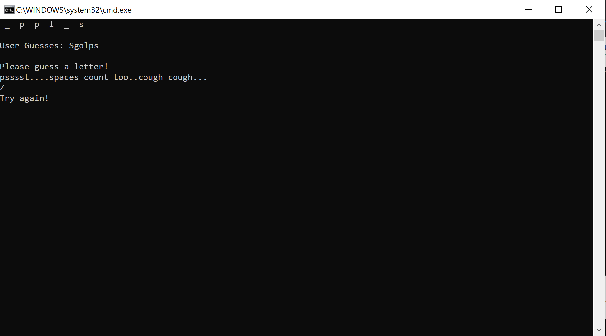

# Lab 03 Word Guessing Game

This is a Word Guess Game built in C# using the Visual Studio IDE. This is to solidify working 
with C# as a language as well as learning about file manipulation and utilizing the CRUD testing
method (Create, Read, Update, and Delete) to ensure a working application.
*** 

Upon starting the application, the user will be prompted with three actions:

* Play Game
* Word List
* Exit

From there, if the user selects Play Game, they will be prompted to guess a randomly selected word
and will keep playing until the word is fully guessed. Guesses are kept track of during the round 
and at the end the user will be prompted to either play again with a new word or return to the 
main menu.

If the user selects Word List, they will be prompted with a sub menu:

* View Words
* Add Word
* Remove Word
* Remove File

These allows the user to either view the current word list from the file, add a word to the list,
remove a word that is typed in from the list, or remove the entire file. The user can also press
enter if they would like to return to the main menu.

If the user decideds to remove the entire file, the application will ask for a confirmation and if
yes is selected, it will delete the file and terminate the program. A file will be created with
default values when the application runs again.

Unit tests are including with the project.
***
## Getting Started
* Download the Lab03-Word-Guess-Game repo
* After it's been downloaded, navigate to the .csproject file and open up Visual Studio. It is 
  built using the latest .NET 2.1 SDK
* Once the project is opened, run it with or without debug and a console should appear. 
  If the below image is what you are greeted with then success! You can now play the Word guess
  game.

### What it should look like
* This is the starting menu of the application

* This is the sub-menu that is accessible if the user selects the Word List option

* This is a sample of game play

***
